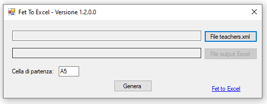
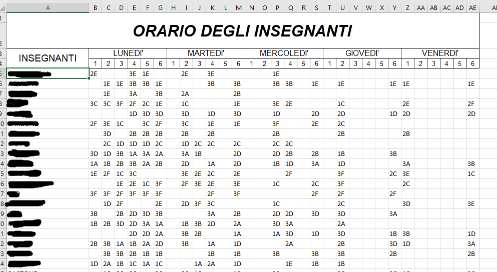

# FET to Excel


### Descrizione

L'utility converte il file teachers (*_teachers.xml), in formato xml, prodotto dal programma [FET](https://lalescu.ro/liviu/fet/download.html)
in formato Excel utilizzando un template Excel. FET è un programma libero per generare l'orario degli insegnanti per le scuole.

Le impostazioni predefinite prevedono che il file 'TemplateOrario.xlsx' impostato in base alle proprie esigenze sia nella stessa cartella del programma.
Inoltre per agevolare la creazione dei file Excel di output, se presente il file config.json, è possibile:
-  impostare il file teachers xml di input o la cartella
-  impostare il file template Excel se diverso dal percorso predefinito
-  impostare il file di output o la cartella. Il nome del file verrà utilizzato come prefisso per creare il file di output (Es. c:\temp\out.xlsx verrà generato il file c:\temp\out_yyyyMMddHHmmss.xlsx)
-  indicare se aprire il file di output direttamente dopo la creazione (valori: true o false)
-  indicare la cella iniziale del file template Excel da dove copiare i dati. 

Attenzione che per il simbolo backslash '\\'  va raddoppiato '\\\\'

File di configurazione (config.json)
```
{
 	"pathTeachersXml" : "C:\\temp\\mah_teachers.xml",
 	"pathTemplateExcel" : "",
 	"pathOuputExcel" : "C:\\temp\\output\\test.xlsx",
 	"openExcel" : true,
 	"cellStartTeachers" : "A5"
 }
```







### Requisiti

Windows con installato il NET Framework 4.6.1 o superiore

### Limitazioni

Attualmente l'utility legge solo il file *_teachers con i 7 giorni della settimana (da domenica a sabato) e le ore giornaliere (01:00 a 23:00)
Il template può essere impostato con la propria formattazione, formule ecc. e le celle verranno copiate a partire dalla cella indicata in maschera (valore predefinito: A5)
Il template allegato di esempio prevede 5 giorni a settimana con 6 ore

### Richieste

Aprite un issue per esigenze diverse 
   
